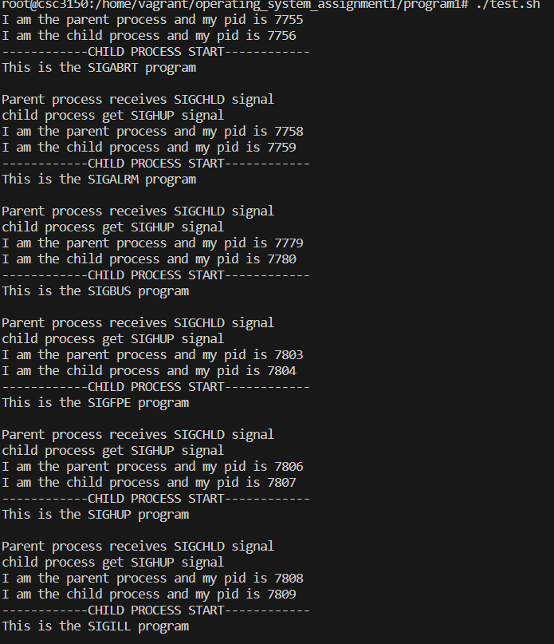

# Assignment1

Might need to read operating system concept 10th edition section 4.7.2


## Task I

- We just need to use some basic function calls fork() to fork a new proccess, if the fork returns 0, then we need to use execve() to do the program inside the argv. Meanwhile, we need to use waitpid to wait for particular child process. The pid of that child process was returned by fork if the process it is now executing is parent process.
- For testing, I wrote a shell file:

```bash
./program1 ./abort
./program1 ./alarm
./program1 ./bus
./program1 ./floating
./program1 ./hangup
./program1 ./illegal_instr
./program1 ./interrupt
./program1 ./kill
./program1 ./Makefi
./program1 ./normal
./program1 ./pipe
./program1 ./program1
./program1 ./quit
./program1 ./segment_fault
./program1 ./stop
./program1 ./terminate
./program1 ./trap
```

- We need to first sudo su and make those file like this:

```bash
sudo su
make
./test.sh
```

- And here is the result



Full result is shown here:

```bash
root@csc3150:/home/vagrant/operating_system_assignment1/program1# ./test.sh 
I am the parent process and my pid is 7871
I am the child process and my pid is 7872
------------CHILD PROCESS START------------
This is the SIGABRT program

Parent process receives SIGCHLD signal
child process get SIGHUP signal
I am the parent process and my pid is 7874
I am the child process and my pid is 7875
------------CHILD PROCESS START------------
This is the SIGALRM program

Parent process receives SIGCHLD signal
child process get SIGHUP signal
I am the parent process and my pid is 7895
I am the child process and my pid is 7896
------------CHILD PROCESS START------------
This is the SIGBUS program

Parent process receives SIGCHLD signal
child process get SIGHUP signal
I am the parent process and my pid is 7919
I am the child process and my pid is 7920
------------CHILD PROCESS START------------
This is the SIGFPE program

Parent process receives SIGCHLD signal
child process get SIGHUP signal
I am the parent process and my pid is 7922
I am the child process and my pid is 7923
------------CHILD PROCESS START------------
This is the SIGHUP program

Parent process receives SIGCHLD signal
child process get SIGHUP signal
I am the parent process and my pid is 7924
I am the child process and my pid is 7925
------------CHILD PROCESS START------------
This is the SIGILL program

Parent process receives SIGCHLD signal
child process get SIGHUP signal
I am the parent process and my pid is 7927
I am the child process and my pid is 7928
------------CHILD PROCESS START------------
This is the SIGINT program

Parent process receives SIGCHLD signal
child process get SIGHUP signal
I am the parent process and my pid is 7929
I am the child process and my pid is 7930
------------CHILD PROCESS START------------
This is the SIGKILL program

Parent process receives SIGCHLD signal
child process get SIGHUP signal
I am the parent process and my pid is 7931
I am the child process and my pid is 7932
execl: No such file or directory
Child exited with status 1
I am the parent process and my pid is 7933
I am the child process and my pid is 7934
------------CHILD PROCESS START------------
This is the normal program

------------CHILD PROCESS END------------
Child exited with status 0
I am the parent process and my pid is 7935
I am the child process and my pid is 7936
------------CHILD PROCESS START------------
This is the SIGPIPE program

Parent process receives SIGCHLD signal
child process get SIGHUP signal
I am the parent process and my pid is 7937
I am the child process and my pid is 7938
Usage: ./program1 <path_to_program>
Child exited with status 1
I am the parent process and my pid is 7939
I am the child process and my pid is 7940
------------CHILD PROCESS START------------
This is the SIGQUIT program

Parent process receives SIGCHLD signal
child process get SIGHUP signal
I am the parent process and my pid is 7942
I am the child process and my pid is 7943
------------CHILD PROCESS START------------
This is the SIGSEGV program

Parent process receives SIGCHLD signal
child process get SIGHUP signal
I am the parent process and my pid is 7945
I am the child process and my pid is 7946
------------CHILD PROCESS START------------
This is the SIGSTOP program

Parent process receives SIGCHLD signal
child process get SIGSTOP signal
I am the parent process and my pid is 7947
I am the child process and my pid is 7948
------------CHILD PROCESS START------------
This is the SIGTERM program

Parent process receives SIGCHLD signal
child process get SIGHUP signal
I am the parent process and my pid is 7949
I am the child process and my pid is 7950
------------CHILD PROCESS START------------
This is the SIGTRAP program

Parent process receives SIGCHLD signal
child process get SIGHUP signal
```

## Task II

To start our kernel programming, we need to first compile a kernel like this:

```bash
wget https://cdn.kernel.org/pub/linux/kernel/v5.x/linux-5.10.197.tar.xz
tar -xvf linux-5.10.197.tar.xz
cd linux-5.10.197
make mrproper
make menuconfig
# There will be a graphical user interface here, directly exit will be fine
```

- To implement the function, we need to first export some functions using

```c
EXPORT_SYMBOL();
```

- Then we need to extern those functions in our program like this:

```c
extern long do_wait(struct wait_opts *wo);
extern int do_execve( struct filename *filename, const char __user *const __user *__argv, const char __user *const __user *__envp);
extern pid_t kernel_clone(struct kernel_clone_args *args);
extern struct filename * getname_kernel(const char * filename);
```

- Since we need to compile our kernel, we need to do this thing again and again, therefore, I directly write a shell file like this:
    
    ```bash
    sudo su
    make bzImage -j$(nproc)
    make modules -j$(nproc)
    make modules_install & install
    reboot now
    ```
    
- Notice that, we also need to copy one data structure wait_opts like this:

```c
struct wait_opts {
	enum pid_type		wo_type;
	int			wo_flags;
	struct pid		*wo_pid;

	struct waitid_info	*wo_info;
	int			wo_stat;
	struct rusage		*wo_rusage;

	wait_queue_entry_t		child_wait;
	int			notask_error;
};
```

- After we prepared the whole process, we now start to implement our kernel program.
    - We call kthread_run to create the thread to run our program
    - In the parent process, we call kernel_clone to create the child process
    - We need to set the child process to be the stack of the kernel_clone_args so that we can run it the child process.
    - We need to put the file that we want to execute inside the child process, and catch the signal that was send.
    - We use the do_wait function to wait for child process to terminates and print out the signal
    - The output signal need to do the and operation with 0x0000007f (127)
- Notice that we need to select the corresponding kernel version when we reboot
- To run the program in kernel and see what is the result, we need to do the following things:

```bash
sudo su
gcc test.c -o test
chmod +x test
mv test /tmp/ # According to the PDF, this procedure is very important
dmesg -c
# You will find some output there, not important
make
insmod program2.ko
rmmod program2
dmesg -c 
# This is the result
```

- If the test code looks like this:

```c
#include <unistd.h>
#include <stdio.h>
#include <signal.h>

int main(int argc,char* argv[]){
	int i=0;

	printf("--------USER PROGRAM--------\n");
//	alarm(2);
	raise(SIGABRT);
	sleep(5);
	printf("user process success!!\n");
	printf("--------USER PROGRAM--------\n");
	return 100;
}
```


## Bonus

Let us first check out how the pstree command runs using 

```c
man pstree
```


And this is how I implement it:

- We know that the process are actually stored in a very special directory called /proc. When we iterate through all those directory and show the result, we can see the process.
- In those file, we know ppid, pid, and name of that particular process.
- According that we need to construct a tree. We first use a doubly linked list to store all the information. And then we start to iterate through all of them. If one does not have a ppid, then it is the root node, and we delete it from the doubly linked list.
- We call the construction process recursively. The process is to identify is this process is one of the child node of this root:

```c
void build_tree(Process* root, Process* proc_list)
```

Since every child process can only have one parent, we delete that pross from the doubly linked list once we find its parent. And call build_tree again, but with the root to be the current process

- After we build the tree, we show it by a recursive print function

```c
void display_tree(Process* proc, int depth, int last_siblings[], int flags) 
```

And here is the final result:

```bash
root@csc3150:/home/vagrant/operating_system_assignment1/pstree# ./test
We already finished the link list construction
systemd 
├─systemd-journal 
├─lvmetad 
├─systemd-udevd 
├─dhclient 
├─iscsid 
├─iscsid 
├─systemd-logind 
├─dbus-daemon 
├─cron 
├─accounts-daemon 
├─lxcfs 
├─atd 
├─rsyslogd 
├─acpid 
├─mdadm 
├─agetty 
├─agetty 
├─unattended-upgr 
├─irqbalance 
├─sshd 
│   └─sshd 
│       └─sshd 
│           └─bash 
│               └─sh 
│                   └─node 
│                       ├─node 
│                       │   └─bash 
│                       │       └─sudo 
│                       │           └─su 
│                       │               └─bash 
│                       │                   └─test 
│                       ├─node 
│                       └─node 
│                           └─cpptools 
├─polkitd 
└─systemd 
    └─(sd-pam)
```

One can add three options there. One is -p and one is -V, the final one is random

```bash
root@csc3150:/home/vagrant/operating_system_assignment1/pstree# ./test -p
We already finished the link list construction
systemd (PID 1)
├─systemd-journal (PID 357)
├─lvmetad (PID 382)
├─systemd-udevd (PID 396)
├─dhclient (PID 820)
├─iscsid (PID 971)
├─iscsid (PID 972)
├─systemd-logind (PID 974)
├─dbus-daemon (PID 976)
├─cron (PID 978)
├─accounts-daemon (PID 979)
├─lxcfs (PID 983)
├─atd (PID 989)
├─rsyslogd (PID 999)
├─acpid (PID 1001)
├─mdadm (PID 1019)
├─agetty (PID 1065)
├─agetty (PID 1067)
├─unattended-upgr (PID 1071)
├─irqbalance (PID 1072)
├─sshd (PID 1075)
│   └─sshd (PID 1601)
│       └─sshd (PID 1662)
│           └─bash (PID 1663)
│               └─sh (PID 1711)
│                   └─node (PID 1720)
│                       ├─node (PID 1780)
│                       │   └─bash (PID 1866)
│                       │       └─sudo (PID 3628)
│                       │           └─su (PID 3629)
│                       │               └─bash (PID 3630)
│                       │                   └─test (PID 4257)
│                       ├─node (PID 1815)
│                       └─node (PID 1822)
│                           └─cpptools (PID 1896)
├─polkitd (PID 1092)
└─systemd (PID 1603)
    └─(sd-pam) (PID 1604)
```

```bash
root@csc3150:/home/vagrant/operating_system_assignment1/pstree# ./test -V
pstree Created by Butian Xiong (butianxiong@link.cuhk.edu.cn)
Created under GNU General Public License
This is free software, and you are welcome to redistribute it under
the terms of the GNU General Public License.
For more information about these matters, see the files named COPYING.
```

```bash
root@csc3150:/home/vagrant/operating_system_assignment1/pstree# ./test dawdasda
Usage: test [-V], [-p]
test display a tree of a process
-V show the version and claim
-p show the pid
if you don't put any flag it will not show the pid
```
